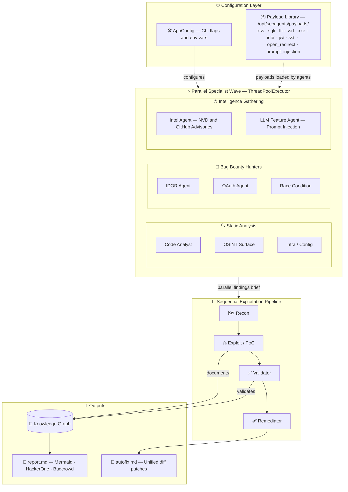

<div align="center">


# ⚡ SecAgents

### Autonomous AI Red-Team Agent Framework

*Deploy a full squad of AI security specialists against your codebase — in seconds.*

[](https://github.com/gl1tch0x1/SecAgents/actions/workflows/ci.yml)
[](https://www.python.org/)
[](LICENSE)
[](https://www.docker.com/)
[]()
[]()

---

> 🔐 **SecAgents** is a Python CLI that deploys an **autonomous multi-agent red team** against your code — complete with parallel specialists, a Docker sandbox, PoC validation, auto-fix patches, and platform-ready reports for **HackerOne** and **Bugcrowd**.

</div>

---

## 🧠 What Makes SecAgents Different

| Feature | Details |
|---|---|
| 🤖 **8 AI Specialists** | Code Analyst, OSINT, Infra/Config, Intel, IDOR, OAuth, Race Condition, LLM Feature — all run in parallel |
| 🐳 **Isolated Docker Sandbox** | Every exploit attempt runs in a locked-down container with `curl`, `nmap`, `mitmproxy`, headless Chrome |
| 💥 **PoC-Backed Findings** | Agents must demonstrate impact — `validated=false` findings are clearly separated from confirmed bugs |
| 📦 **30,000+ Payloads** | XSS, SQLi, LFI, SSRF, XXE, SSTI, IDOR, JWT, Open Redirect, Prompt Injection — sourced from PayloadsAllTheThings |
| 📊 **Platform Reports** | Auto-generates HackerOne and Bugcrowd VRT-mapped markdown reports |
| 🔧 **Auto-Fix Patches** | Remediator agent generates copy-paste-ready unified diffs for every confirmed finding |
| 🔗 **CI/CD Ready** | Native `secagents ci` command with exit-code gate for GitHub Actions |
| 🔑 **LLM-Agnostic** | Run with OpenAI, Anthropic Claude, or local Ollama — same interface |

---

**Pipeline:**

```
⚙️ Config + 📦 Payloads
       ↓
⚡ Parallel Specialists  ──  [Code Analyst] [OSINT] [Infra] [IDOR] [OAuth] [Race] [Intel] [LLM]
       ↓
🗺️  Recon  →  💥 Exploit/PoC  →  ✅ Validator  →  🩹 Remediator
       ↓
📊 Outputs: report.md · report.json · autofix.md · knowledge_graph.json
```


### Architectural Workflow



### 🛠️ Agentic Toolkit (Sandbox Image)
> 🧪 **Isolated Environment**: Every scan runs inside a fortified Docker sandbox, pre-loaded with:
> - **Proxies**: `mitmproxy` + custom sniffing scripts
> - **Browsers**: Headless Chromium (`secagents-chrome`)
> - **Tools**: `nmap`, `curl`, `openssl`, `nc`, `socat`, `rg`, `bandit`
> - **Runtimes**: JRE, Node, Ruby, Go, Python
> - **FileSystem**: Read-only `/workspace` access

---

## 🎖️ The Security Specialist Squad

SecAgents deploys a parallel wave of dedicated AI experts, each with a specific focus area:

| Specialist | Icon | Focus Area |
| :--- | :---: | :--- |
| **Code Analyst** | 🔍 | Deep static analysis, logic flaws, and sensitive data leakage. |
| **OSINT Surface** | 🌐 | Public surface area mapping and metadata leakage. |
| **Infra / Config** | 🏗️ | Dockerfile, K8s, and Cloud configuration misalignments. |
| **Intel Agent** | 🛡️ | Real-time CVE mapping via NVD and GitHub Advisories. |
| **IDOR Hunter** | 🔑 | Indirect Object Reference and authorization bypasses. |
| **OAuth Specialist** | 🎟️ | PKCE, Redirect URI, and State token validation flaws. |
| **Race Navigator** | 🏎️ | TOCTOU and concurrent execution state vulnerabilities. |
| **LLM Guard** | 🤖 | Prompt injection and AI-specific feature exploitation. |

---

> [!WARNING]
> **Safety First**: SecAgents is a powerful offensive security tool. Only run it against targets you are authorized to test. Review all sandbox logs before acting on findings.

---

## 🚀 Quick Start

### 1️⃣ Prerequisites
- **Python**: 3.11+
- **Docker**: Desktop or Engine (running)
- **Git**: For cloning the core repo

### 2️⃣ Installation
```bash
# Clone the nexus
git clone https://github.com/gl1tch0x1/SecAgents.git
cd SecAgents

# Deploy locally
pip install -e .
```

### 3️⃣ Health Check
```bash
secagents doctor
```

---

## ⚡ Multi-Provider Deployment

Choose your intelligence engine based on your environment:

#### 🟢 Option A: Ollama (Local & Private)
```bash
secagents setup-ollama --model llama3.2
secagents scan ./target --provider ollama --model llama3.2
```

#### 🟡 Option B: OpenAI (Global Scale)
```bash
export OPENAI_API_KEY=sk-...
secagents scan ./target --provider openai --model gpt-4o-mini
```

#### 🟠 Option C: Anthropic (Deep Reasoning)
```bash
export ANTHROPIC_API_KEY=sk-ant-...
secagents scan ./target --provider anthropic --model claude-3-5-sonnet-latest
```

---

## 📊 Mission Intelligence & Output

Once the squad completes its mission, it generates a comprehensive intelligence package in your `--out-dir`:

- **`report.md`**: Mission debrief with Mermaid attack flows and VRT mappings.
- **`report.json`**: Structured data for CI/CD ingestion.
- **`autofix.md`**: Battle-tested unified diff patches to neutralize findings.
- **`knowledge_graph.json`**: Full relational map of discovered assets and vulnerabilities.

### 🎯 Bug Bounty Ready
Generate submission-ready reports for major platforms:
```bash
secagents scan ./project --platform h1        # HackerOne Optimization
secagents scan ./project --platform bugcrowd  # Bugcrowd VRT Alignment
```

---

## 🛠️ CLI Operations

| Command | Action |
| :--- | :--- |
| `secagents doctor` | Diagnostic run for Docker and environment health. |
| `secagents scan <target>` | Initialize a full multi-agent red-team operation. |
| `secagents ci <path>` | Execute a gatekeeper scan for CI/CD pipelines. |
| `secagents setup-ollama` | Provisions a local Ollama instance for private AI. |

---

## 📦 Payload Inventory
SecAgents mounts a massive, structured library at `/opt/secagents/payloads/`:
- **Expansion**: Run `python build_payloads.py` to sync 30k+ fresh payloads from *PayloadsAllTheThings*.
- **Categories**: `xss`, `sqli`, `lfi`, `ssrf`, `xxe`, `idor`, `jwt`, `open_redirect`, `ssti`, `prompt_injection`.

---

## ⛓️ CI/CD Integration

Integrate SecAgents into your development lifecycle:

- **`.github/workflows/ci.yml`**: High-speed linting and unit testing.
- **`.github/workflows/secagents.yml`**: Autonomous security gate for every Pull Request.

```bash
# Fail the pipeline on High severity findings
secagents ci ./src --provider openai --model gpt-4o-mini --fail-on high
```

---

## 📜 Metadata & Legal

- **License**: [MIT](LICENSE)
- **Security**: [SECURITY.md](SECURITY.md)
- **Contribution**: [CONTRIBUTING.md](CONTRIBUTING.md)
- **Changelog**: [CHANGELOG.md](CHANGELOG.md)

<div align="center">
  <sub>Built by security researchers, for the next generation of offensive AI.</sub>
</div>
