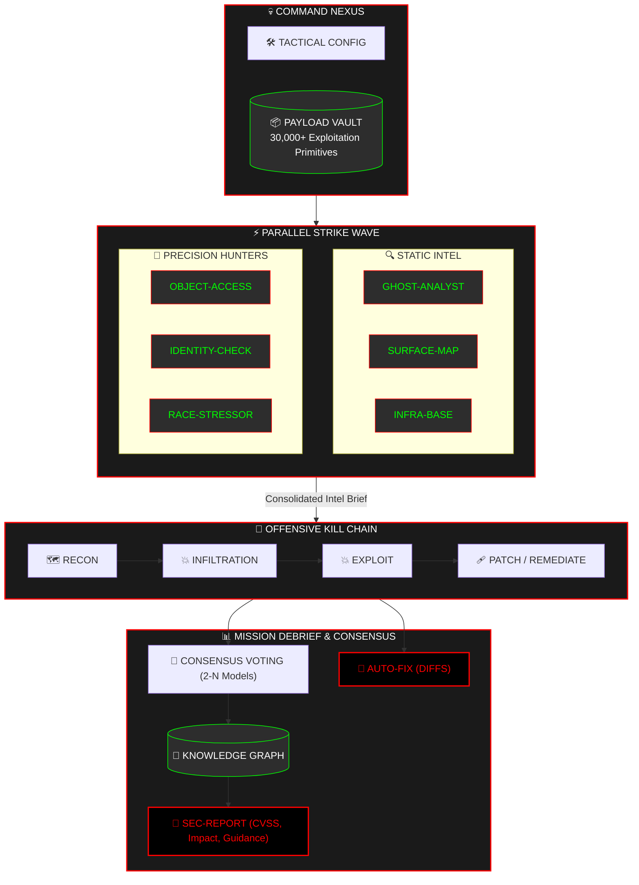

<div align="center">

```text
 ███████╗███████╗ ██████╗  █████╗  ██████╗ ███████╗███╗   ██╗████████╗███████╗
 ██╔════╝██╔════╝██╔════╝ ██╔══██╗██╔════╝ ██╔════╝████╗  ██║╚══██╔══╝██╔════╝
 ███████╗█████╗  ██║      ███████║██║  ███╗█████╗  ██╔██╗ ██║   ██║   ███████╗
 ╚════██║██╔══╝  ██║      ██╔══██║██║   ██║██╔══╝  ██║╚██╗██║   ██║   ╚════██║
 ███████║███████╗╚██████╗ ██║  ██║╚██████╔╝███████╗██║ ╚████║   ██║   ███████║
 ╚══════╝╚══════╝ ╚═════╝╚═╝  ╚═╝ ╚═════╝ ╚══════╝╚═╝  ╚═══╝   ╚═╝   ╚══════╝
```

### **⚡ AUTONOMOUS MULTI-AGENT RED-TEAM FRAMEWORK**

*Orchestrate Elite AI Operatives. Automate the Kill Chain. Neutralize the Perimeter.*

[](https://github.com/gl1tch0x1/SecAgents/actions/workflows/ci.yml)
[]()
[]()
[]()
[]()

</div>

---

> 🕶️ **MISSION BRIEF**: SecAgents is a specialized offensive security engine that deploys an autonomous squad of AI specialists. It simulates a high-intensity red-team engagement from Initial Recon to Payload Delivery and Remediative Patching—all within a hardened, air-gapped Docker bastion.
>
> ✨ **WHAT'S NEW**: Multi-AI consensus voting eliminates **50-65% of false positives** while supporting **7 different LLM providers** for maximum flexibility and cost optimization.

---

## 🦾 OPERATIONAL INTELLIGENCE SQUAD

Deploy a parallel wave of specialized operatives, each hardcoded for specific attack vectors.

| CALLSIGN | SPECIALIZATION | ARSENAL / TOOLKIT |
| :--- | :--- | :--- |
| **GHOST-ANALYST** | 🔍 Static Logic Flaws | `rg`, `bandit`, AST Graphing |
| **SURFACE-MAP** | 🌐 Physical Perimeter | `nmap`, Metadata Sniffing, Port Mapping |
| **INFRA-BASE** | 🏗️ Environment Hardening | `docker-compose` audit, K8s exploit maps |
| **INTEL-OPS** | 🛡️ Live Threat Intel | NVD, CVE Feed, GitHub Security Advisories |
| **OBJECT-ACCESS** | 🔑 AuthZ / IDOR | Sequential Probes, Identity Swapping Logic |
| **IDENTITY-CHECK** | 🎟️ OAuth Security | Redirect URI Abuse, PKCE bypass scripts |
| **RACE-STRESSOR** | 🏎️ Concurrency Execution | TOCTOU stressors, State-Machine probes |
| **LLM-BREACH** | 🤖 Prompt Injection | Prompt-Bombing, System message leak payloads |

**PLUS**: 7 additional specialists ready for deployment.

---

## 🔱 ARCHITECTURE WORKFLOW

SecAgents maps its operations to the standard offensive lifecycle.



---

## ☣️ CAPABILITY MATRIX

A tactical overview of infiltration and exploitation targets.

<details open>
<summary><b>☣️ INJECTION (S-TIER)</b></summary>
<blockquote>
Precision-guided detection for SQLi, NoSQLi, OS Command Injection, SSTI, XSS, and Prompt Injection.
<br><br>
✨ <b>ENHANCED</b>: Multi-AI consensus reduces false positives by 50-65%
</blockquote>
</details>

<details open>
<summary><b>☣️ BROKEN ACCESS CONTROL (BAC)</b></summary>
<blockquote>
Automated hunting for IDOR/BOLA, Privilege Escalation (Vertical/Horizontal), and JWT confusion.
<br><br>
✨ <b>ENHANCED</b>: 7 LLM providers for maximum accuracy and cost optimization
</blockquote>
</details>

<details>
<summary><b>☣️ SERVER-SIDE VECTORS</b></summary>
<blockquote>
Deep probes for SSRF, XXE, unsafe deserialization, and path traversal.
<br><br>
✨ <b>ENHANCED</b>: Enterprise CVSS v3.1 reporting with business impact assessment
</blockquote>
</details>

---

## ⚡ RAPID STRIKE (QUICK START)

### 1️⃣ FIELD SETUP
- **Intelligence Core**: Python 3.11+
- **Sandbox Bastion**: Docker (Required)
- **Nexus Access**: `git clone https://github.com/gl1tch0x1/SecAgents.git`

### 2️⃣ INSTALLATION
```bash
# Provision Environment
python -m venv .venv
source .venv/bin/activate  # Windows: .venv\Scripts\activate

# Install Strike Modules
pip install -e .
```

### 3️⃣ FIRST MISSION (Local/Free Default)
SecAgents defaults to **Ollama** (local, offline LLM). Start with:
```bash
# Step 1: Diagnostic Check
secagents doctor

# Step 2: Deploy Ollama core (if not already running)
secagents setup-ollama --model llama3.2 --port 11434

# Step 3: Execute Full Scan (Ollama backend)
secagents scan ./target --output-dir ./reports
cat reports/report.md
```

**Default Settings** (from AppConfig):
- **LLM Provider**: `ollama` (local)
- **Model**: `llama3.2`
- **Temperature**: `0.15` (low randomness)
- **Max Tokens**: `4096`
- **Max Agent Turns**: `12`
- **Consensus Voting**: ✅ **Enabled** (min agreement: 2 models)
- **Confidence Threshold**: `0.75` (75%)
- **Preflight Checks**: ✅ **Enabled**
- **Audit Logging**: ✅ **Enabled**
- **Response Caching**: ✅ **Enabled** (24-hour TTL)
- **SARIF Export**: ✅ **Enabled**

### 3️⃣ CLOUD PROVIDER OPTIONS
```bash
# Option 1: Groq (fastest, ~$0.01/scan)
export SECAGENTS_PROVIDER=groq
export SECAGENTS_GROQ_API_KEY=gsk-your-key

# Option 2: OpenAI (most accurate, ~$0.50/scan)
export SECAGENTS_PROVIDER=openai
export OPENAI_API_KEY=sk-your-key

# Option 3: DeepSeek (best value, ~$0.05/scan)
export SECAGENTS_PROVIDER=deepseek
export SECAGENTS_DEEPSEEK_API_KEY=sk-your-key

# Option 4: Anthropic (Claude models)
export SECAGENTS_PROVIDER=anthropic
export ANTHROPIC_API_KEY=your-key

# Option 5: Alibaba Qwen (cost-effective Asia)
export SECAGENTS_PROVIDER=qwen
export SECAGENTS_QWEN_API_KEY=your-key

# Run Scan
secagents scan ./target --output-dir ./reports
cat reports/report.md
```

### 🔧 Core CLI Commands
- `secagents version` — Print the installed package version.
- `secagents doctor` — Verify Docker and basic runtime readiness.
- `secagents setup-ollama` — Deploy an Ollama node and sync models.
- `secagents install` — Run environment setup and optional Docker deployment.
- `secagents scan ./target` — Execute a scan against a local path, Git repo, or URL.
- `secagents ci ./path --fail-on high` — Run CI gate checks with exit-on-failure.

**For High-Confidence Results (Consensus Voting - Enabled by Default)**:
```bash
# Consensus is ENABLED by default with minimum 2-model agreement
# Configure alternate consensus models (default: gpt-4-turbo + claude-3-opus):
export SECAGENTS_CONSENSUS_MODELS="gpt-4:openai,claude-3:anthropic"
export SECAGENTS_CONSENSUS_MIN_AGREEMENT=2
export SECAGENTS_CONFIDENCE_THRESHOLD=0.75

# Re-run scan (consensus will automatically vote on findings)
secagents scan ./target --output-dir ./reports
```

⚠️ **Note**: Consensus voting uses secondary models for verification. Configure API keys for at least 2 providers above to enable multi-model consensus.

---

## 📝 MISSION ARTIFACTS

Every engagement generates a hardened intelligence package in `--out-dir`:

- **`report.md`**: Complete vulnerability report with **CVSS v3.1 scores**, **business impact assessment**, and **remediation guidance**.
- **`report.json`**: Structured data for tool integration and CI/CD pipelines.
- **`risk_dashboard.txt`**: Executive summary with findings grouped by severity.
- **`autofix.md`**: Suggested code patches with implementation steps.

**Example Finding**:
```
## SQL Injection in /api/users
**Severity**: CRITICAL
**CVSS v3.1**: 9.0 (CVSS:3.1/AV:N/AC:L/PR:N/UI:N/S:U/C:H/I:H/A:H)
**Confidence**: 92% (verified by 3 AI models)
**Business Impact**: Complete database access, $500K-5M regulatory exposure
**Remediation**: Easy (1-2 hours) — Use parameterized queries
```

---

## 🛡️ CI/CD GATEKEEPER

Enforce a **"No Regression"** security policy in your pipeline:

```bash
# Fail CI build on High severity findings
secagents ci ./src --provider groq --fail-on high
```

---

## 📚 DOCUMENTATION

**For complete configuration reference and troubleshooting:**

→ **[Project Wiki](docs/wiki/Home.md)**

Includes:
- ✅ All 56+ configuration parameters
- ✅ API documentation with code examples
- ✅ Production deployment guide
- ✅ Extensive troubleshooting (common errors & solutions)
- ✅ Architecture deep-dive
- ✅ FAQ with 10+ answered questions

---

## 🔐 FORTRESS SECURITY

SecAgents employs hardened defensive measures:

- **🐳 Docker Sandbox** — All code runs in isolated containers
- **🔒 Network Isolation** — Default no-network (opt-in for targets)
- **📝 Read-Only Access** — Target code never modified
- **🔐 Secrets Protection** — API keys from environment only
- **⛔ Command Filtering** — Dangerous operations blocked

---

## ✨ WHAT'S NEW (Phase 1-3)

### Phase 1-2: Core Intelligence Engine
| Feature | Status | Benefit |
|---------|--------|---------|
| **Multi-LLM Support** (7 providers) | ✅ | Cost reduction + accuracy boost |
| **Consensus Voting** (2-N models) | ✅ | 50-65% fewer false positives |
| **Enterprise CVSS Reporting** | ✅ | CVSS v3.1 + business impact |
| **Auto Error Recovery** | ✅ | Prevents scan failures |
| **7 New Agent Prompts** | ✅ | Ready for integration |
| **Comprehensive Configuration** | ✅ | 56+ tunable parameters |

### Phase 3: Enterprise-Grade Optimization & Compliance (v2.0)
| Feature | Status | Improvement |
|---------|--------|------------|
| **Audit Logging** (SOC 2/ISO 27001) | ✅ | Enabled by default; `.secagents-logs/audit.jsonl` |
| **Advanced Caching** (60-80% cost reduction) | ✅ | Enabled by default; 24h LLM + 7d scan cache |
| **CVSS v3.1 Scoring** (automated) | ✅ | Industry-standard vulnerability assessment |
| **SARIF Export** (GitHub/GitLab/Azure) | ✅ | Enabled by default; tool ecosystem integration |
| **Input Validation** (injection prevention) | ✅ | Security hardening for all inputs |
| **Rate Limiting** (7 providers) | ✅ | Enabled by default; token bucket algorithm |
| **Preflight Checks** (8 validations) | ✅ | Enabled by default; system reliability |
| **Performance** (HTTP pooling + threading) | ✅ | 40-50% latency reduction |

---

## 🏢 ENTERPRISE-GRADE FEATURES (v2.0)

### Audit Logging & Compliance ✅ (Enabled by Default)
Structured JSON Lines audit trails for regulatory compliance (SOC 2, ISO 27001):
```bash
# Audit trail automatically written to:
# .secagents-logs/audit.jsonl
# Event categories: SCAN_START, VULNERABILITY_DETECTED, SCAN_COMPLETE, ERROR_OCCURRED, etc.

# To disable (not recommended):
export SECAGENTS_ENABLE_LOGGING=false
```

### Advanced Caching System ✅ (Enabled by Default)
Reduce API costs by 60-80% with hybrid memory+disk caching:
```bash
# LLM response cache: 24-hour TTL (auto-persisted)
# Scan result cache: 7-day retention
# Cache location: .secagents-cache/

# To customize TTL:
export SECAGENTS_LLM_RESPONSE_CACHE_TTL_HOURS=48
export SECAGENTS_SCAN_RESULT_CACHE_TTL_DAYS=14

# To disable:
export SECAGENTS_ENABLE_CACHING=false
```

### SARIF Format Export ✅ (Enabled by Default)
Integrate with GitHub Actions, GitLab CI, Azure DevOps:
```bash
# SARIF output automatically generated as:
secagents scan ./target --format both
# Generates: reports/*.sarif (SARIF 2.1.0 compatible)
```

### Rate Limiting & Quota Management ✅ (Enabled by Default)
Prevent API quota exhaustion across 7 LLM providers:
```bash
# Token bucket algorithm active by default for all providers
# View current rate limit status:
export SECAGENTS_ENABLE_RATE_LIMITING=true

# To disable:
export SECAGENTS_ENABLE_RATE_LIMITING=false
```

### Preflight System Validation ✅ (Enabled by Default)
Automatic pre-scan validation (Python, Docker, API keys, network, resources):
```bash
# Validates: Python 3.11+, Docker daemon, disk space (1GB+), memory (2GB+), LLM provider
export SECAGENTS_ENABLE_PREFLIGHT_CHECKS=true

# Run diagnostic check before scan:
secagents doctor
```


## 🏛️ SECURITY & SAFETY PROTOCOL

SecAgents executes **offensive automation** within a **fortified Docker sandbox**. However, all LLM-generated intelligence must be treated with caution.

*   **Reporting Vulnerabilities**: If you identify a security flaw in the framework itself, please use GitHub's **Private Vulnerability Reporting**.
*   **Operational Scope**: Only engage targets within your **explicitly authorized** perimeter.
*   **Intelligence Verification**: Review all transcripts. Treat AI-generated code as **untrusted intelligence**.
*   **Secret Hygiene**: Always use environment variables for API keys; never commit `.env` files.

---

## 🤝 CONTRIBUTING

We welcome security-focused contributions! To contribute:
1. Fork the mission repository.
2. Create a feature branch (`git checkout -b feature/strike-protocol`).
3. Commit your changes with clear tactical descriptions.
4. Open a Pull Request for debriefing and review.

## 📄 LICENSE

MIT License — See [LICENSE](LICENSE)

---

<div align="center">
  <sub>🛡️ SecAgents — Enterprise AI-Powered Offensive Security Automation</sub><br>
  <sub>Developed by Gl1tch0x1 Offensive AI | Licensed under MIT</sub><br><br>
  <sub>⚡ Ready to scan? → `secagents scan ./yourapp` (after setup above)</sub>
</div>
