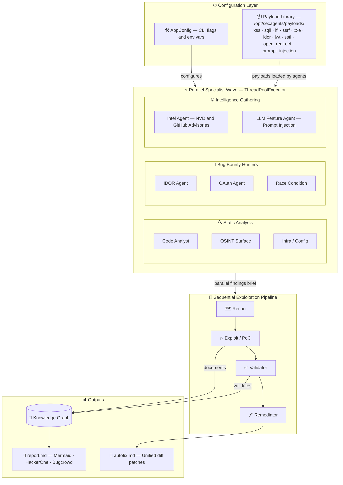

# SecAgents

[](https://github.com/YOUR_ORG/secagents/actions/workflows/ci.yml)

Python CLI that runs **autonomous multi-agent red teams** against your code—built for developers and security teams who want **fast, PoC-backed testing** without full manual pentest overhead or static-analysis noise.

**Full documentation (wiki-style):** [docs/wiki/Home.md](docs/wiki/Home.md) — installation, usage, GitHub Actions, operations. Replace `YOUR_ORG/secagents` in badge URLs and in `pyproject.toml` `[project.urls]` after you create the repository.

**Pipeline (default):** **Parallel specialists** (Code analyst + OSINT; with `--parallel-specialists 3+`, **Infra/Config** joins the same parallel wave) → **Recon** → **Exploit/PoC** → **Validator** → **Remediator**. Outputs merge into a **knowledge graph** (`knowledge_graph.json`, Mermaid in `report.md`) for shared attack documentation.

### Architectural Workflow



- **Agentic toolkit (sandbox image):** **HTTP proxy** (mitmproxy when install succeeds + `/opt/secagents/bin/mitm_sniff.sh`), **headless Chromium** (`secagents-chrome` per URL / “tab”), **batch shells**, **Python + bandit**, `rg`/`find`/`nmap`/`curl`/`openssl`/`nc`/`socat`, plus JRE/Node/Ruby/Go. Read-only `/workspace`; **no network** by default (enable for URL targets). **Rebuild** the image after upgrades: `docker rmi secagents-sandbox:latest` then run a scan.
- **PoC validation:** Findings separate into **validated** (command/output evidence) vs **needs triage** to reduce false positives.
- **Targets:** local folder, Git URL, or live `https://` URL (probe + optional network-backed checks).
- **LLMs:** OpenAI, Anthropic, or **Ollama**. Tune `--temperature`, `--top-p`, `--max-tokens`, `--max-turns`, `--recon-turns`, `--validation-turns`.
- **CLI:** `--team` / `--no-team`, `--parallel-specialists` (`1` off, `2` code+OSINT, **`3+` adds Infra/Config** in parallel), `--sandbox-timeout`, `--sandbox-shm`, `--remediation` / `--no-remediation`, CI via `secagents ci` + `.github/workflows/secagents.yml`.
- **Coverage:** Access control, injection, server-side (SSRF/XXE/deserialization), client-side (XSS/prototype pollution/DOM), business logic, auth/session, infrastructure misconfig (see prompts / model behavior).

> ⚠️ **Safety Notice:** SecAgents runs attacker-style automation against your targets. Only use it on code, systems, or URLs you own or are **explicitly authorized** to test. Always review sandbox commands in generated transcripts.

---

## Table of Contents

1. [Prerequisites](#1-prerequisites)
2. [Installation](#2-installation)
3. [Health Check](#3-health-check)
4. [Choose Your LLM Provider](#4-choose-your-llm-provider)
5. [Running Your First Scan](#5-running-your-first-scan)
6. [CLI Reference](#6-cli-reference)
7. [Configuration Reference](#7-configuration-reference)
8. [Understanding the Output](#8-understanding-the-output)
9. [Bug Bounty Mode](#9-bug-bounty-mode)
10. [GitHub Actions / CI Integration](#10-github-actions--ci-integration)
11. [Updating SecAgents](#11-updating-secagents)
12. [Refreshing the Payload Library](#12-refreshing-the-payload-library)
13. [Limitations](#13-limitations)
14. [License](#14-license)

---

## 1. Prerequisites

Before installing SecAgents, make sure you have the following installed on your machine:

| Requirement | Version | Notes |
|-------------|---------|-------|
| **Python** | 3.11 or newer | `python --version` to verify |
| **Docker** | Latest stable | Desktop or Engine; daemon must be running |
| **Git** | Any | To clone this repository |

- **Windows:** Install [Python from python.org](https://www.python.org/downloads/) and [Docker Desktop](https://www.docker.com/products/docker-desktop/).
- **macOS:** `brew install python docker` (or install Docker Desktop).
- **Linux:** `sudo apt install python3 python3-pip` + install Docker Engine.

---

## 2. Installation

### Step 1 — Clone the repository

```bash
git clone https://github.com/gl1tch0x1/SecAgents.git
cd SecAgents
```

### Step 2 — Install in editable mode (recommended)

```bash
# Creates a local editable install so `secagents` is available system-wide
pip install -e .
```

> **Tip:** Use a virtual environment to keep your system Python clean:
> ```bash
> python -m venv .venv
> # Windows:
> .venv\Scripts\activate
> # macOS / Linux:
> source .venv/bin/activate
>
> pip install -e .
> ```

### Step 3 — Verify the install

```bash
secagents version
# Expected: SecAgents x.y.z
```

If `secagents` isn't found, try:

```bash
python -m secagents version
```

Or add Python's `Scripts/` directory to your PATH (Windows users often need this).

---

## 3. Health Check

Run the built-in doctor command to verify Docker is reachable and everything is configured:

```bash
secagents doctor
```

Expected output:
```
✅ Docker daemon reachable
✅ Python 3.12.x
✅ SecAgents v0.1.1
```

If Docker shows an error, make sure the Docker daemon is running:
- **Windows/macOS:** Open Docker Desktop.
- **Linux:** `sudo systemctl start docker`

---

## 4. Choose Your LLM Provider

SecAgents supports three LLM backends. Pick one:

### Option A — Ollama (local, free, no API key)

Best for privacy-conscious users and offline environments.

```bash
# Pull and start Ollama with a model (one-time setup)
secagents setup-ollama --model llama3.2

# Run a scan using Ollama
secagents scan ./my-project --provider ollama --model llama3.2
```

> Requires Docker. The command pulls the Ollama image and model automatically.

### Option B — OpenAI

```bash
# Set your API key (or add to .env file)
export OPENAI_API_KEY=sk-...          # macOS / Linux
$env:OPENAI_API_KEY="sk-..."          # Windows PowerShell

secagents scan ./my-project --provider openai --model gpt-4o-mini
```

### Option C — Anthropic (Claude)

```bash
export ANTHROPIC_API_KEY=sk-ant-...   # macOS / Linux
$env:ANTHROPIC_API_KEY="sk-ant-..."   # Windows PowerShell

secagents scan ./my-project --provider anthropic --model claude-3-5-haiku-20241022
```

### Using a `.env` file (recommended)

Create a `.env` file in the project root so you don't have to set env vars every session:

```ini
# .env — never commit this file
OPENAI_API_KEY=sk-...
ANTHROPIC_API_KEY=sk-ant-...
SECAGENTS_PROVIDER=openai
SECAGENTS_MODEL=gpt-4o-mini
```

---

## 5. Running Your First Scan

### Scan a local project folder

```bash
secagents scan ./my-project
```

### Scan a GitHub repository (clones automatically)

```bash
secagents scan https://github.com/org/repo --kind repo --branch main
```

### Scan a live web URL

```bash
secagents scan https://example.com --kind url --allow-network
```


MIT — see [LICENSE](LICENSE). Security disclosures: [SECURITY.md](SECURITY.md). Contributing: [CONTRIBUTING.md](CONTRIBUTING.md). Changelog: [CHANGELOG.md](CHANGELOG.md).
