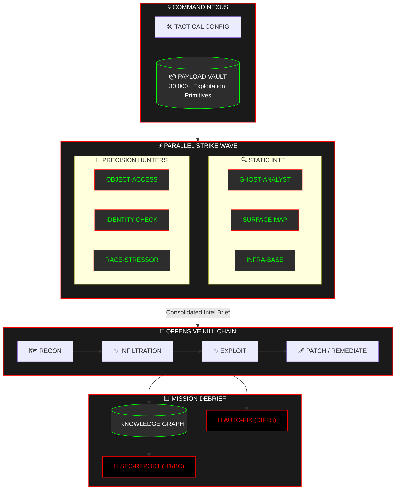

<div align="center">

```text
 ███████╗███████╗ ██████╗  █████╗  ██████╗ ███████╗███╗   ██╗████████╗███████╗
 ██╔════╝██╔════╝██╔════╝ ██╔══██╗██╔════╝ ██╔════╝████╗  ██║╚══██╔══╝██╔════╝
 ███████╗█████╗  ██║      ███████║██║  ███╗█████╗  ██╔██╗ ██║   ██║   ███████╗
 ╚════██║██╔══╝  ██║      ██╔══██║██║   ██║██╔══╝  ██║╚██╗██║   ██║   ╚════██║
 ███████║███████╗╚██████╗ ██║  ██║╚██████╔╝███████╗██║ ╚████║   ██║   ███████║
 ╚══════╝╚══════╝ ╚═════╝╚═╝  ╚═╝ ╚═════╝ ╚══════╝╚═╝  ╚═══╝   ╚═╝   ╚══════╝
```

### **⚡ AUTONOMOUS MULTI-AGENT RED-TEAM FRAMEWORK**

*Orchestrate Elite AI Operatives. Automate the Kill Chain. Neutralize the Perimeter.*

[](https://github.com/gl1tch0x1/SecAgents/actions/workflows/ci.yml)
[]()
[]()
[]()

---

> 🕶️ **MISSION BRIEF**: SecAgents is a specialized offensive security engine that deploys an autonomous squad of AI specialists. It simulates a high-intensity red-team engagement from Initial Recon to Payload Delivery and Remediative Patching—all within a hardened, air-gapped Docker bastion.

</div>

---

## 🦾 OPERATIONAL INTELLIGENCE SQUAD

Deploy a parallel wave of specialized operatives, each hardcoded for specific attack vectors.

| CALLSIGN | SPECIALIZATION | ARSENAL / TOOLKIT |
| :--- | :--- | :--- |
| **GHOST-ANALYST** | 🔍 Static Logic Flaws | `rg`, `bandit`, AST Graphing |
| **SURFACE-MAP** | 🌐 Physical Perimeter | `nmap`, Metadata Sniffing, Port Mapping |
| **INFRA-BASE** | 🏗️ Environment Hardening | `docker-compose` audit, K8s exploit maps |
| **INTEL-OPS** | 🛡️ Live Threat Intel | NVD, CVE Feed, GitHub Security Advisories |
| **OBJECT-ACCESS** | 🔑 AuthZ / IDOR | Sequential Probes, Identity Swapping Logic |
| **IDENTITY-CHECK** | 🎟️ OAuth Security | Redirect URI Abuse, PKCE bypass scripts |
| **RACE-STRESSOR** | 🏎️ Concurrency Execution | TOCTOU stressors, State-Machine probes |
| **LLM-BREACH** | 🤖 Prompt Injection | Prompt-Bombing, System message leak payloads |

---

## 🔱 THE KILL CHAIN (Mermaid)

SecAgents maps its operations to the standard offensive lifecycle.



---

## ☣️ CAPABILITY MATRIX

A tactical overview of infiltration and exploitation targets.

<details open>
<summary><b>☣️ INJECTION (S-TIER)</b></summary>
<blockquote>
Precision-guided detection for SQLi, NoSQLi, OS Command Injection, SSTI, XSS, and Prompt Injection.
</blockquote>
</details>

<details open>
<summary><b>☣️ BROKEN ACCESS CONTROL (BAC)</b></summary>
<blockquote>
Automated hunting for IDOR/BOLA, Privilege Escalation (Vertical/Horizontal), and JWT confusion.
</blockquote>
</details>

<details>
<summary><b>☣️ SERVER-SIDE VECTORS</b></summary>
<blockquote>
Deep probes for SSRF, XXE, unsafe deserialization, and path traversal.
</blockquote>
</details>

---

## ⚡ RAPID STRIKE (QUICK START)

### 1️⃣ FIELD SETUP
- **Intelligence Core**: Python 3.11+
- **Sandbox Bastion**: Docker (Required)
- **Nexus Access**: `git clone https://github.com/gl1tch0x1/SecAgents.git`

### 2️⃣ INSTALLATION
```bash
# Provision Environment
python -m venv .venv
source .venv/bin/activate  # Windowns: .venv\Scripts\activate

# Install Strike Modules
pip install -e .
```

### 3️⃣ FIRST MISSION
```bash
# Diagnostic Check
secagents doctor

# Execute Full Scan (Local AI)
secagents setup-ollama --model llama3.2
secagents scan ./target --provider ollama --model llama3.2
```

---

## 📝 MISSION ARTIFACTS

Every engagement generates a hardened intelligence package in `--out-dir`:

- **`report.md`**: Mission debrief with **Platform-Specific** formatting (HackerOne VRT / Bugcrowd VRT).
- **`autofix.md`**: Immediate remediation diffs to neutralize findings.
- **`knowledge_graph.json`**: Structured graph of the entire attack surface.

---

## 🛡️ CI/CD GATEKEEPER

Enforce a **"No Regression"** security policy in your pipeline:

```bash
# Fail CI build on High severity findings
secagents ci ./src --provider openai --model gpt-4o --fail-on high
```

---

<div align="center">
  <sub>Developed by Gl1tch0x1 Offensive AI | Licensed under MIT</sub>
</div>
