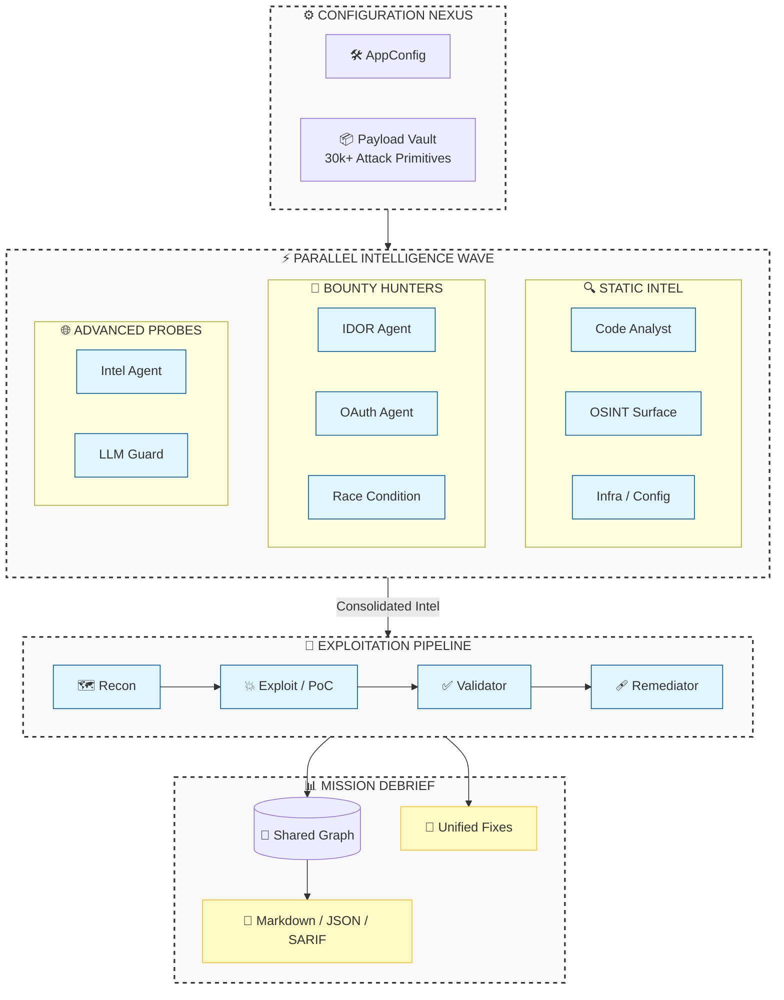

<div align="center">


# ⚡ SECAGENTS

### **The Autonomous AI Red-Team Agent Framework**

*Deploy a full squad of elite AI security specialists against your codebase in seconds.*

[](https://github.com/gl1tch0x1/SecAgents/actions/workflows/ci.yml)
[](https://www.python.org/)
[](LICENSE)
[](https://www.docker.com/)
[]()

---

> 🔐 **MISSION DIRECTIVE**: SecAgents is a specialized Python CLI that deploys an autonomous multi-agent red team. It orchestrates parallel specialists through a Docker-fortified sandbox to deliver **High-Fidelity PoCs**, **Auto-Fix Patches**, and **Intelligence Reports** for HackerOne and Bugcrowd.

</div>

---

## 🏛️ ARCHITECTURAL ORCHESTRATION

SecAgents utilizes a multi-layered execution model that simulates a real-world penetration testing squad.



---

## 🎖️ THE SQUAD: ROLES & ARSENALS

Deploy up to 8 parallel specialists, each precision-tuned for specific vulnerability classes.

| OPERATIVE | PRIMARY FOCUS | ARSENAL / TOOLKIT |
| :--- | :--- | :--- |
| **Code Analyst** | 🔍 Static Logic & Flow | `rg`, `bandit`, Abstract Syntax Trees |
| **OSINT Surface** | 🌐 External Exposure | `nmap`, Metadata Probes, Config Sniffers |
| **Infra Specialist** | 🏗️ Environment Hardening | `docker-compose` audit, K8s manifest checks |
| **Intel Agent** | 🛡️ Vulnerability Feed | NVD, GitHub Security Advisories, CVE Data |
| **IDOR Hunter** | 🔑 AuthZ & Object Access | Sequential Probes, Identity Swapping |
| **OAuth Specialist** | 🎟️ Identity Workflows | Redirect URI Abuse, PKCE Validation checks |
| **Race Navigator** | 🏎️ Concurrency Logic | TOCTOU probes, State-Machine Stressors |
| **LLM Guard** | 🤖 Prompt & AI Logic | Injection payloads, Chatbot IDOR, System Leak checks |

---

## 📡 CAPABILITY MATRIX (VULNERABILITY COVERAGE)

SecAgents is built to detect, validate, and remediate high-impact vulnerabilities:

<details open>
<summary><b>🛠️ Injection Dominance</b></summary>
<blockquote>
S-Tier detection for SQLi, NoSQLi, OS Command Injection, LDAP, Template (SSTI), and Log Injection.
</blockquote>
</details>

<details open>
<summary><b>🔑 Broken Access Control</b></summary>
<blockquote>
Automated identification of IDOR, horizontal/vertical privilege escalation, and broken object-level authorization (BOLA).
</blockquote>
</details>

<details>
<summary><b>🌐 Server-Side & Infrastructure</b></summary>
<blockquote>
Deep probes for SSRF, XXE, unsafe deserialization, path traversal, and file upload abuse.
</blockquote>
</details>

<details>
<summary><b>🎭 Client-Side & Session</b></summary>
<blockquote>
Reflected/Stored/DOM XSS, prototype pollution, open redirects, CORS misconfigurations, and weak JWT implementations.
</blockquote>
</details>

---

## 🚀 EXPEDITED DEPLOYMENT

### 1️⃣ PREREQUISITES
- **Python**: 3.11+
- **Docker**: Engine or Desktop initialized
- **Repository**: `git clone https://github.com/gl1tch0x1/SecAgents.git`

### 2️⃣ INSTALLATION
```bash
# Initialize Virtualization
python -m venv .venv
source .venv/bin/activate  # or .venv\Scripts\activate on Windows

# Deploy Framework
pip install -e .
```

### 3️⃣ THE "FIRST STRIKE" SCAN
```bash
# Run a quick health check
secagents doctor

# Launch scan using local AI (Ollama)
secagents setup-ollama --model llama3.2
secagents scan ./target-app --provider ollama --model llama3.2
```

---

## 📊 INTELLIGENCE ARTIFACTS

SecAgents produces high-density actionable intelligence:

- **`report.md`**: The primary debrief. Includes executive summaries, visual attack chains, and **Platform-Specific formats** (HackerOne/Bugcrowd).
- **`autofix.md`**: Zero-day to zero-impact. Precise, unified diff patches for every validated finding.
- **`knowledge_graph.json`**: For the data scientists. A full relational map of every discovery, probe, and agent decision.

---

## ⛓️ ENTERPRISE CI/CD INTEGRATION

Native support for **GitHub Actions**. Use `secagents ci` to fail builds on high-severity security regression:

```bash
secagents ci ./src --provider openai --model gpt-4o --fail-on high
```

---

## 🗺️ OPERATIONAL ROADMAP

- [ ] **SARIF Support**: Direct integration with GitHub Advanced Security.
- [ ] **Multi-Node Orchestration**: Parallel scans across distributed agent clusters.
- [ ] **Mitmproxy Auto-Sniff**: Fully integrated dynamic request interception.
- [ ] **OIDC Integration**: Secure cloud LLM authentication.

---

<div align="center">
  <sub>Developed by Gl1tch0x1 Security Research | Licensed under MIT</sub>
</div>
